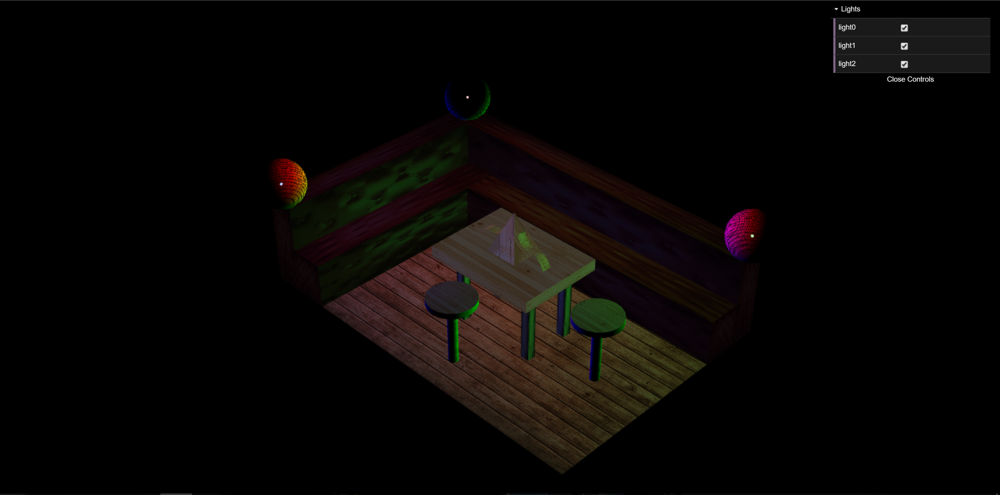
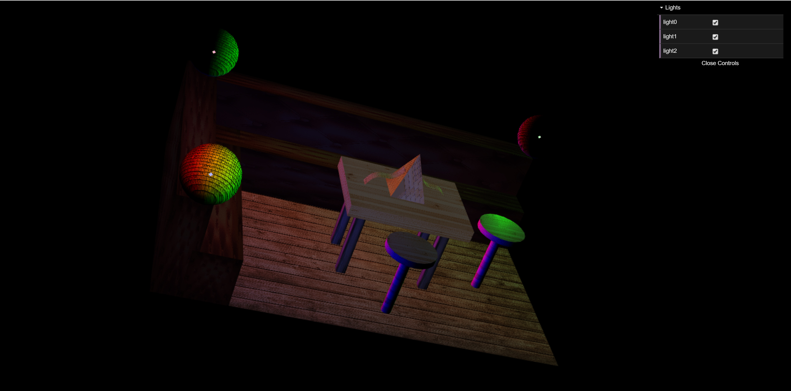

# Project 1

On this first project we were suposed to:

1. Read an XML file with a scene

2. Create nodes and leafs from the read file

3. Create basic scene elements for scene rendering:
    - rectangle
    - triangle
    - circle
    - tube
    - cylinder
    - sphere
    - nurb surface

4. Apply transformations, material appearances and textures, contained in node elements

5. Scene rendering

# Result

