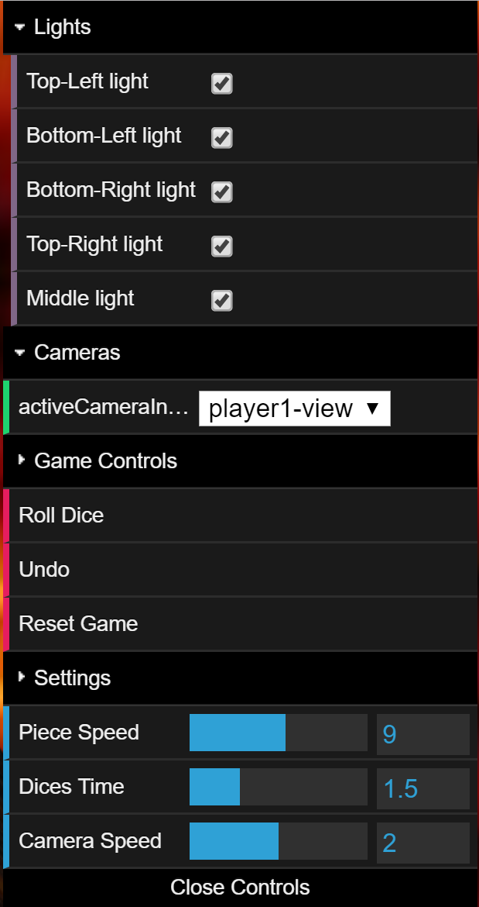

# Project 3

On this first project we were suposed to:

1.Create more than one game scene, so we created two diferent scenes with the same board, as you can see in the pictures below:
![gameScene1]
![gameScene2]

2. Make the necessary pieces so the game could be played. So we did:
  * Player 1 piece
  
    ![player1PieceImage]
  
  * Player 2 piece
  
    ![player2PieceImage]
  
  * Dice
  
    ![DiceImage]

3. Everything had to be design in the game lsx file. To facilitate future game scene creations we created a camera node, witch contains all camera prespectives of the game. The game needs at least three cameras:
   * player1-view
   * player2-view
   * dice-view
   
   The camera node code has to follow the next structure:
   ```xml
   <CAMERA id="player1-view">
     <fov value="0.7"/>
     <near value="0.1"/>
     <far value="500"/>
     <position xx="0.0" yy="11.0" zz="20.0" />
     <target xx="0.0" yy="0.0" zz="0.0" />
    </CAMERA>
   ```
   The game will parse the cameras and they will be available for switching in the game interface. The camera "moves" between positions, the transtions are not instant, and are computed by [Camera Transtion](./GameLogic/CameraTransition.js) class.

4. Implement several game funcionalities: 
   1. Game Logic:
       This is handled mostly by the [Game Logic](./GameLogic/gamelogic.js) class that keeps track of the players pieces and checks if         the plays are valid or not. It saves previous plays in an array of [User Plays](./GameLogic/userPlay.js) class objects.
   2. Game time and timing:
       This is mostly handled in [XMLscene.js](./Parser/XMLscene.js) file, but [Game Logic](./GameLogic/gamelogic.js) controls the time       that both players have to make a move and the time that the game shows the dices.
   3. Undo and Reset options: 
       You are able to undo the last play made. When you click the undo button on the game interface the last moved piece will go back         to his previous place and if that piece had thrown an enemy piece off the board, that one will be on the board again. Also you can       reset game by clicking the reset game button. This will make all pieces return to their base. All of this with animations, no           teletransportation under my watch. This is handled in [XMLscene.js](./Parser/XMLscene.js) and triggered by this function in the         [Interface](./Parser/MyInterface.js) file:
       
      ```javascript
      MyInterface.prototype.gameControlsGroup = function(scene)
      {
        var group = this.gui.addFolder("Game Controls");

       ...

       this.gui.add(scene, 'undo').name('Undo');
     
       this.gui.add(scene, 'resetGame').name('Reset Game');

       ...
      }
      ```
      The game Interface:
   
      
  4. Game score board and menus:
      
        
   
# Result
 * Throwing a piece off the board
 
 ![GamePlay]
 
 * Game Reset
 
 ![Reset]


[gameScene1]: ./Media/Game_Scene_1.png
[gameScene2]: ./Media/Game_Scene_2.png
[player1PieceImage]: ./Media/Player_One_Piece.png
[player2PieceImage]: ./Media/Player_Two_Piece.png
[DiceImage]: ./Media/Dice.png
[GamePlay]: ./Media/gamePlay.gif
[Reset]: ./Media/reset.gif

